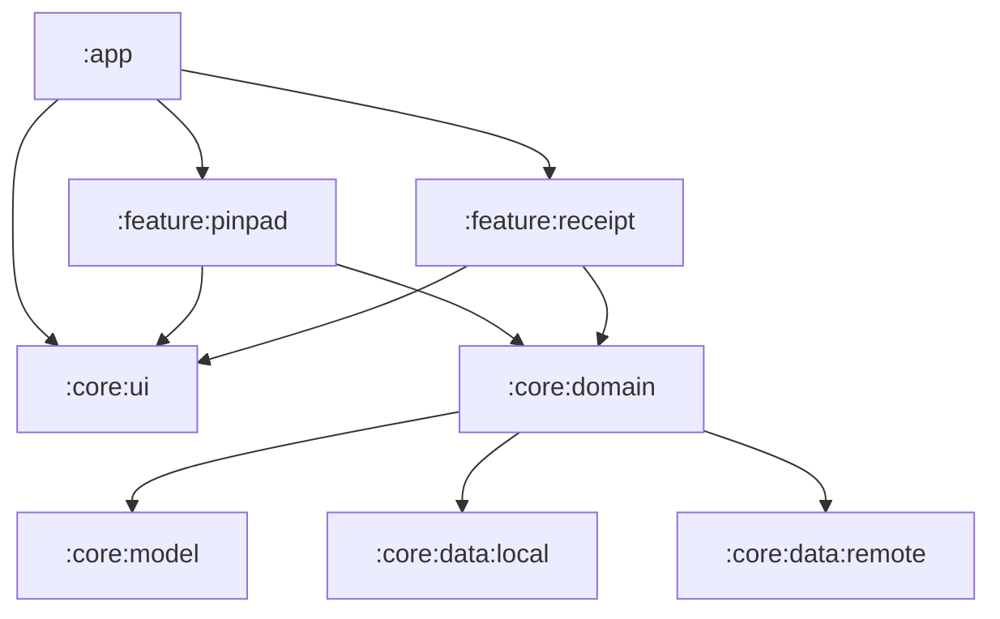
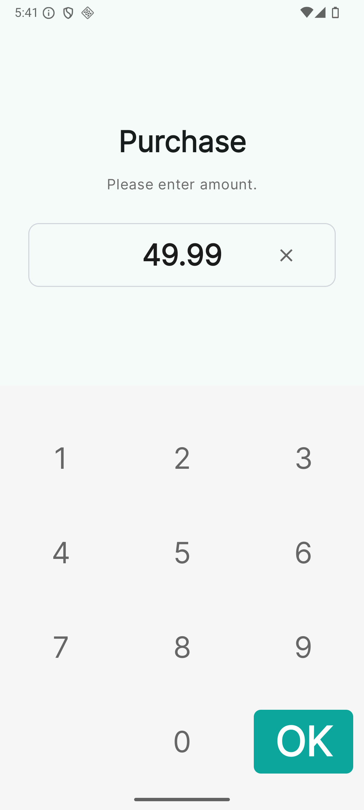
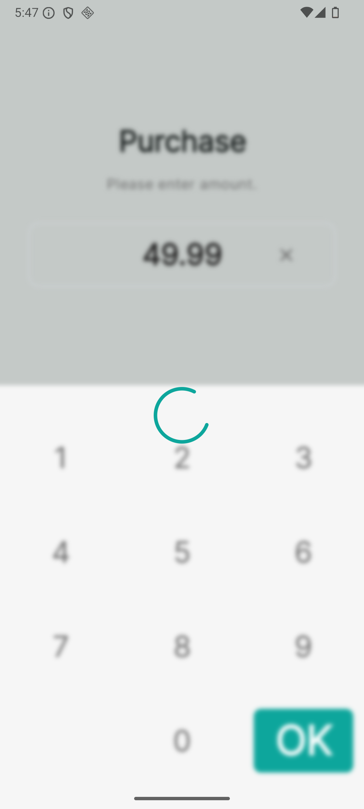
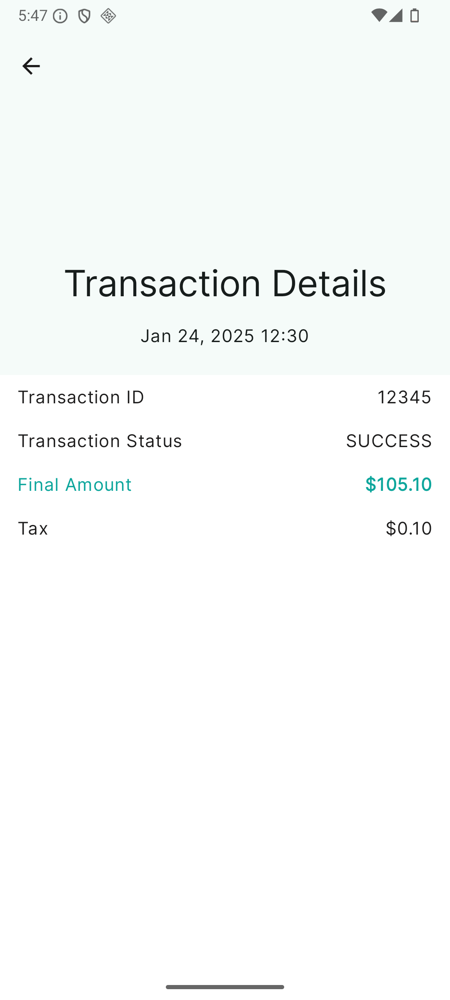
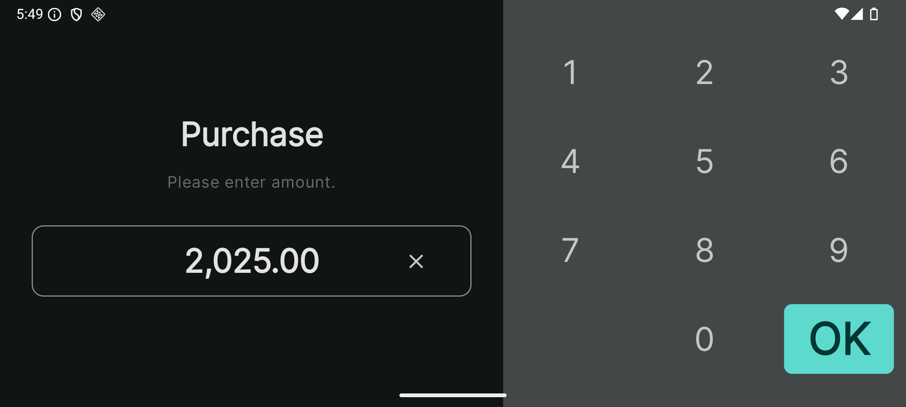
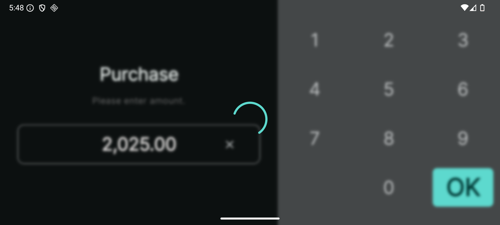
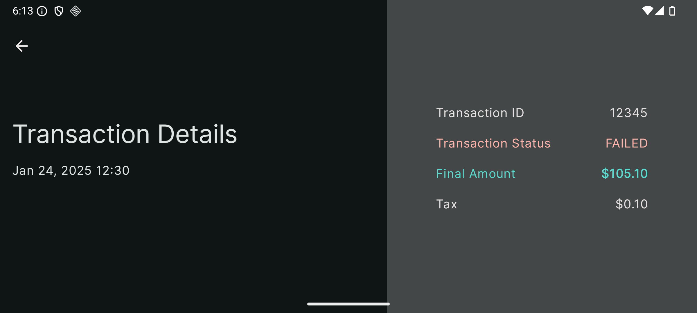

# PaymentApp 📲

A modular **Jetpack Compose** Android application that simulates a Point‑of‑Sale flow.

- **PinPad screen** — enter / edit an amount, submit a payment

- **Receipt screen** — show the final transaction details

- **Clean Architecture** — clear separation of **UI ▸ Domain ▸ Data** layers

- **Material 3** design system & dynamic color

- **Portrait & landscape** support

---

## Table of Contents

1. [Project structure](#project-structure)

2. [Module graph](#module-graph)

3. [Getting started](#getting-started)

4. [Tech stack](#tech-stack)

5. [Screenshots](#screenshots)

6. [Roadmap](#roadmap)

7. [License](#License and Usage Notice)

---

## Project Structure

```text
.
├── app/                       ← Application entry point (DI, navigation)
│
├── core/
│   ├── model/                 ← Kotlin data classes shared across layers
│   ├── domain/                ← Repositories & use‑cases (business logic)
│   ├── data/
│   │   ├── local/             ← In‑memory DB  → future Room/DataStore
│   │   └── remote/            ← Ktor REST client stub
│   └── ui/                    ← Material 3 theme & reusable Compose widgets
│
├── feature/
│   ├── pinpad/                ← PinPad feature‑module
│   └── receipt/               ← Receipt feature‑module
│
└── build‑logic/               ← Custom Gradle convention plugins
```

---

## Module Graph



---

## Getting Started

```bash
# 1 . Clone
$ git clone https://github.com/your‑org/payment-app.git
$ cd payment-app

# 2 . Open with Android Studio Iguana (or newer)
# 3 . Run
$ ./gradlew installDebug   # or just press ▶ in the IDE
```

> **Note** – all library versions are managed via **Gradle Version Catalogs** (`gradle/libs.versions.toml`).

---

## Tech Stack

| Area               | Library                                              | Docs                                                                                           |
| ------------------ | ---------------------------------------------------- | ---------------------------------------------------------------------------------------------- |
| UI                 | **Jetpack Compose**, **Material 3**                  | [https://developer.android.com/jetpack/compose](https://developer.android.com/jetpack/compose) |
| DI                 | **Hilt**                                             | [https://dagger.dev/hilt](https://dagger.dev/hilt)                                             |
| Networking         | **Ktor Client**                                      | [https://ktor.io/docs/http-client.html](https://ktor.io/docs/http-client.html)                 |
| Persistence (stub) | In‑memory ↔ will migrate to **Room / DataStore**     | –                                                                                              |
| Gradle             | Version Catalogs, Convention plugins (`build‑logic`) | –                                                                                              |

---

## Screenshots

|  |  |  |
|:----------------------------------------:|:------------------------------------------:|--------------------------------------------|

|    |
|--------------------------------------------------------------------|
|  |
|  |

---

## Roadmap

- Extract per‑feature domain modules (`feature‑x:domain`)

- Unit tests for use‑cases & repositories

- Instrumentation + Compose UI tests

- Replace in‑memory DB with **Room** + **DataStore** migration

- Support for large and foldable devices

- Real backend

- CI pipeline (GitHub Actions) for lint, test, assemble

- Accessibility pass & talkback labels

---

## License and Usage Notice

This repository is provided **for technical assignment purposes only**.    
It is not licensed for public reuse or distribution.
